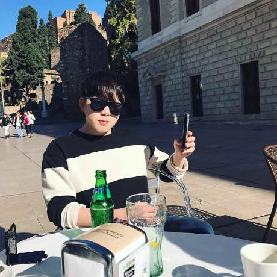

#  모아모아, 모임 통장 기반 커뮤니티

## 프로젝트 소개

  

모아모아는 삼성청년 SW 아카데미 핀테크 프로젝트로 시작하였으며, 모임 통장과 SNS가 결합된 서비스에요. 저희는 "소비도 결국 추억이 된다." 라는 모토로 해당 서비스를 기획하였으며, 모임에서 지출한 소비를 강력한 커뮤니티와 엮어 사용자에게 제공하려고 노력했어요.
지금부터 프로젝트에 대한 상세 소개를 시작하겠습니다. 

## 주요기능

1. SNS 기능
* SNS 기능은 사용자가 글을 남기고 모임에 대한 추억을 공유할 수 있는 기능이에요. 사용자는 글과 함께 사진을 업로드할 수 있으며, 그 외에도 좋아요 / 댓글과 같은 부가적인 기능을 추가했어요. 

2. 지출 내역 관리
* 지출 내역은 모임 통장의 투명한 관리를 위해 도입했어요. 모임 통장의 총무는 통장의 소비 내역에 관련된 증빙 내역(영수증, 모임 사진 등)을 등록하여 모임 통장의 소비 내역을 증빙할 수 있어요.

3. 태그 기능
* 태그 기능은 모아모아의 가장 핵심적인 기능이에요. "소비도 결국 추억이 된다." 라는 저희의 모토처럼, 저희는 소비 내역을 SNS와 맵핑하였어요. 사용자는 소비 내역에 해당하는 게시물을 볼 수 있고 역으로 게시물에 해당하는 소비 내역도 확인 가능해요. 저희는 이 기능을 구현하기위해 각 소비 항목에 태그를 도입하여 게시물과 연결시켰어요.

## 서비스 아키텍처
 

💁‍♂️ 저희는 아키텍처로 MSA을 사용했으며, 쿠버네티스 환경위에 독립적으로 배포를 진행했어요.

💁‍♂️ 전체 애플리케이션을 유저 서비스 / 모임 서비스 / 일정 서비스 / 계좌 서비스 / 멤버 서비스로 나누어 독립적인 환경으로 나누었어요.

💁‍♂️ 또한 istio을 사용하여 서비스 메쉬를 구성, 각 서비스의 트래픽을 제어하는 enovy 프록시를 통해 트래픽을 관리했어요.

💁‍♂️ 맨 앞단에 Reverse Proxy를 통해 프론트 엔드와 백엔드 트래픽을 분기하였으며, IstioGateway를 통해 백엔드 트래픽을 라우팅하고 jwt 검증 작업을 구현했어요.

💁‍♂️ 더 자세한 구성은 다음 링크나, 서브모듈로 추가한 moremore-k8s 레포지토리를 참고해주시면 감사하겠습니다. 🙇‍♂️ <a href="https://github.com/parkjumsun/moremore-k8s">인프라 레포지토리</a>

## 핵심 사용 기술
### Frontend

### Backend

### DB

### 인프라

## 관련 링크

### [Figma](https://www.figma.com/design/5QgAm1KSTLmZ3D03IJWPm6/A605_%ED%8A%B9%ED%99%94?node-id=0-1&node-type=canvas&t=K2nL2s0sd6gB4LiO-0)
### [ERD](https://www.erdcloud.com/d/w73ETWtLGgLsHbtL3)
### [기능 명세서](https://awake-peak-786.notion.site/2f7e1226aaf84eb3841c75b2615df9bc)
### [API Docs](https://awake-peak-786.notion.site/API-ad7c9df76be34d29b0a3976a73cf4c01)

## 팀원 정보
| 박지환 | 박정선 | 신승호 | 옥진석 | 이재성 | 권주안 |
|:------:|:------:|:------:|:------:|:------:| :------:|
|  |  |  |  |  |  
| 팀장/BE | BE/infra | BE | FE | FE | FE |
| [GitHub](https://github.com/ParkJiHwan22) | [GitHub](https://github.com/parkjumsun) | [GitHub](https://github.com/ssh2957) | [GitHub](https://github.com/JJOK97) | [GitHub](https://github.com/nunori) | [GitHub](https://github.com/YqqAH) 
| 계좌서비스, 일정 서비스 구현 | 인프라 구축, 모임 서비스 구현 | 멤버서비스, 게시물 서비스 구현| 프론트 엔드 구현 | 프론트 엔드 구현 | 프론트 엔드 구현